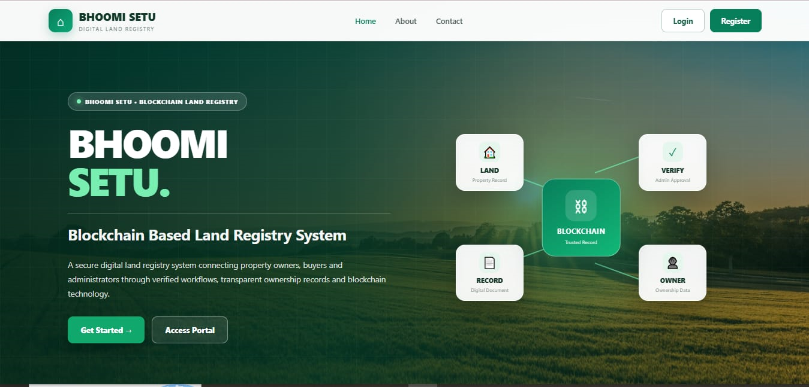
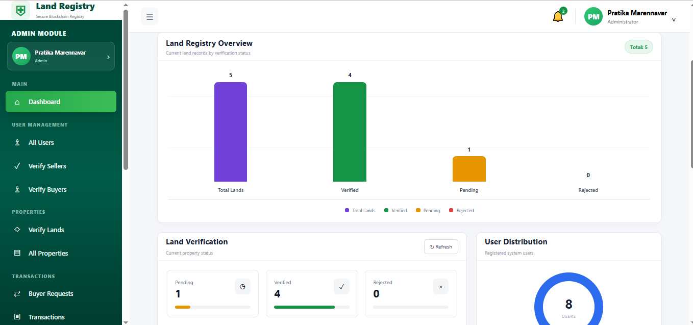
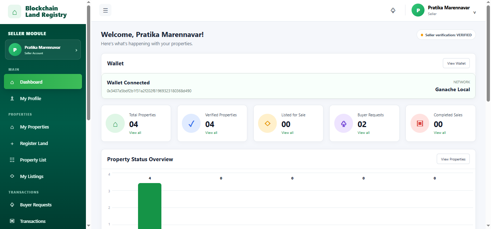
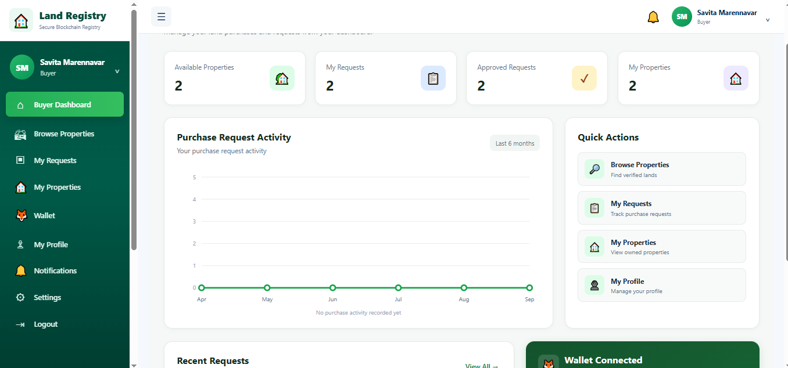
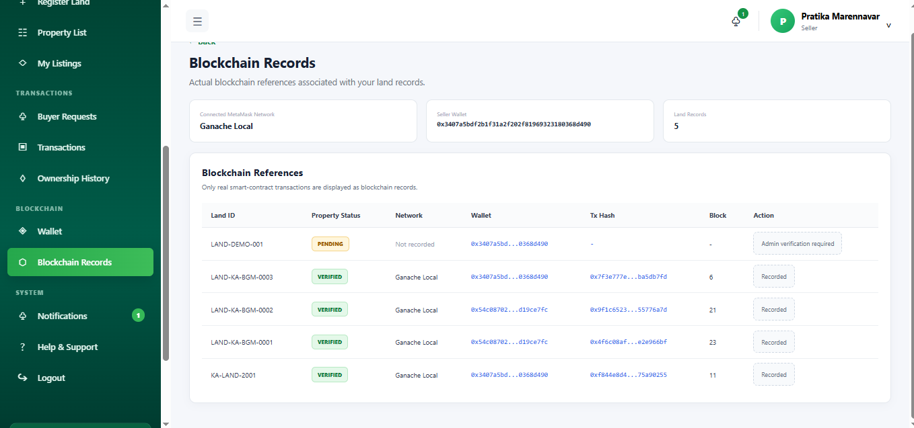
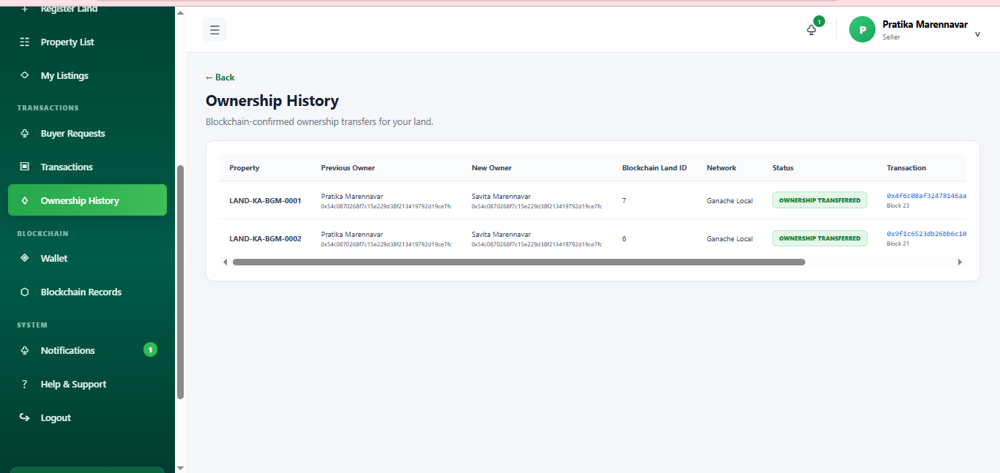

# Blockchain Based Land Registry System

A decentralized land registry system designed to make land registration, verification, purchase requests, and ownership transfers more transparent and secure using **Blockchain technology**.

The system combines a React frontend, Node.js backend, MySQL database, MetaMask, Ganache, and a Solidity smart contract to maintain land and ownership records.

## Project Overview

Traditional land registration systems depend heavily on centralized databases and manual verification. This project provides a blockchain-based approach where important land and ownership information can be recorded and verified through blockchain transactions.

The system supports three main users:

* **Admin** – Verifies sellers, buyers, and land records.
* **Seller** – Registers land, views requests, and approves sale requests.
* **Buyer** – Views verified properties, requests to purchase land, and views purchased properties.

## Main Features

### Admin Module

* Admin login
* Admin dashboard
* View all users
* Seller verification
* Buyer verification
* Land verification
* View all registered properties
* View buyer purchase requests
* View blockchain transaction records

### Seller Module

* Seller registration and login
* MetaMask wallet connection
* Blockchain user registration
* Blockchain seller verification
* Admin verification
* Land registration
* Land verification
* View registered properties
* Receive buyer purchase requests
* Approve sale requests
* View transaction details
* View ownership history

### Buyer Module

* Buyer registration and login
* MetaMask wallet connection
* Blockchain user registration
* Blockchain buyer verification
* View verified properties
* Request to purchase land
* View purchase requests
* View purchased properties
* View current ownership information
* View blockchain transaction details
* Ownership proof information after successful transfer

## Blockchain Workflow

The main blockchain transaction flow is:

```text
Seller Registration
       ↓
Blockchain User Registration
       ↓
Admin Verification
       ↓
Seller Registers Land
       ↓
Land Recorded on Blockchain
       ↓
Admin Verifies Land
       ↓
Buyer Views Verified Land
       ↓
Buyer Requests to Purchase
       ↓
Blockchain requestToBuy()
       ↓
Seller Views Request
       ↓
Seller Approves Sale
       ↓
Blockchain approveSale()
       ↓
Ownership Transferred
       ↓
Buyer Becomes New Owner
```

## Technology Stack

### Frontend

* React.js
* Vite
* JavaScript
* HTML
* CSS
* React Router

### Backend

* Node.js
* Express.js
* REST API

### Database

* MySQL

### Blockchain

* Solidity
* Ethereum-compatible blockchain
* Ganache
* MetaMask
* Ethers.js

### Development Tools

* Visual Studio Code
* Ganache
* MetaMask
* Git
* GitHub

## Smart Contract

The project uses a Solidity smart contract named:

```text
LandRegistry
```

The smart contract handles important blockchain operations such as:

* Blockchain user registration
* Blockchain user verification
* Land registration
* Land verification
* Buyer purchase requests
* Sale approval
* Ownership transfer

### Important Blockchain Functions

```text
registerUser()
verifyUser()
registerLand()
verifyLand()
requestToBuy()
approveSale()
```

The exact function names may vary according to the deployed contract implementation.

## Blockchain Data

The blockchain stores important land and ownership information such as:

* Blockchain Land ID
* Owner name
* Location
* Survey number
* Area
* Document hash
* Owner wallet address
* Registration status
* Verification status
* Sale request status
* Buyer wallet address
* Sale approval status

## Document Hashing

The project does not use IPFS.

Instead, the document is processed to generate a **hash value**. The hash acts as a digital representation of the document.

If the document changes, its hash will also change. The stored blockchain hash can therefore be used to verify whether the document corresponds to the original registered record.

The actual document is not stored directly on the blockchain.

## MetaMask

MetaMask is used as the wallet interface between the web application and the blockchain.

It is used for:

* Connecting user wallets
* Identifying blockchain users
* Signing blockchain transactions
* Sending transactions to Ganache
* Viewing transaction confirmations

## Ganache

Ganache is used as the local blockchain network for development and demonstration.

The project uses Ganache accounts to perform blockchain transactions without requiring the Ethereum mainnet.

The application connects to the local Ganache network through MetaMask.

## Database and Blockchain

The project uses both MySQL and blockchain.

### MySQL

MySQL is used for application-level data such as:

* User information
* Login information
* Verification information
* Land application information
* Requests
* Transaction records
* Application-related records

### Blockchain

Blockchain is used for important decentralized records such as:

* Land registration
* Land verification
* Purchase requests
* Sale approval
* Ownership transfer
* Blockchain transaction information

This combination allows the application to handle normal application data through the database while maintaining important transaction and ownership operations on the blockchain.

## Ownership Transfer

The ownership transfer process works as follows:

1. Buyer selects a verified land.
2. Buyer sends a purchase request.
3. The request is recorded through the blockchain.
4. Seller receives the purchase request.
5. Seller approves the sale.
6. The smart contract transfers ownership.
7. The buyer wallet becomes the new blockchain owner.
8. The transaction hash is recorded.
9. The database ownership information is updated.
10. The buyer can view the purchased property.

## Transaction Records

Blockchain transactions generate transaction hashes.

The application displays transaction information such as:

* Transaction hash
* Block number
* Blockchain network
* Transaction status
* Ownership information

This allows blockchain operations performed during the demonstration to be traced back to their blockchain transactions.

## Project Structure

A simplified project structure is:

```text
TN-Land-Registry-Blockchain/
│
├── frontend/
│   └── dapp/
│       ├── src/
│       │   ├── components/
│       │   ├── pages/
│       │   │   ├── admin/
│       │   │   ├── seller/
│       │   │   └── buyer/
│       │   ├── utils/
│       │   ├── App.jsx
│       │   └── main.jsx
│       │
│       ├── package.json
│       └── vite.config.js
│
├── backend/
│   ├── routes/
│   ├── controllers/
│   ├── models/
│   ├── middleware/
│   ├── config/
│   └── server.js
│
└── blockchain/
    └── contracts/
        └── LandRegistry.sol
```

> The exact folder structure can differ depending on the final repository organization.

## Requirements

Before running the project, install:

* Node.js
* npm
* MySQL
* Ganache
* MetaMask
* Git

## Installation

### 1. Clone the Repository

```bash
git clone YOUR_GITHUB_REPOSITORY_URL
```

```bash
cd TN-Land-Registry-Blockchain
```

### 2. Install Frontend Dependencies

```bash
cd frontend/dapp
npm install
```

### 3. Start the Frontend

```bash
npm run dev
```

The Vite development server will provide the local frontend URL.

### 4. Start the Backend

Open another terminal and navigate to the backend directory:

```bash
cd backend
npm install
```

Start the backend using the project's configured command, for example:

```bash
npm start
```

### 5. Start MySQL

Make sure the MySQL server is running and the project's database has been created and configured.

Update the backend database configuration according to your local MySQL credentials.

### 6. Start Ganache

Open Ganache and start the local blockchain network.

Import the required Ganache account into MetaMask using its private key.

Make sure MetaMask is connected to the Ganache network used by the project.

## Environment Variables

Create the required `.env` files according to the project's configuration.

Example frontend configuration:

```env
VITE_LAND_REGISTRY_ADDRESS=YOUR_DEPLOYED_CONTRACT_ADDRESS
```

Example backend configuration:

```env
PORT=5000
DB_HOST=localhost
DB_USER=YOUR_MYSQL_USER
DB_PASSWORD=YOUR_MYSQL_PASSWORD
DB_NAME=YOUR_DATABASE_NAME
```

Do not upload passwords, private keys, API keys, or other sensitive credentials to GitHub.

## Running the Project

The basic development setup is:

```text
MySQL
  ↓
Backend API
  ↓
React/Vite Frontend
  ↓
MetaMask
  ↓
Ganache
  ↓
LandRegistry Smart Contract
```

Start:

1. MySQL
2. Ganache
3. Backend
4. Frontend
5. MetaMask connected to Ganache

Then open the frontend application in the browser.

## Demo Flow

A complete project demonstration can be performed in this order:

### Admin

1. Open Admin Login.
2. Login as Admin.
3. Open Admin Dashboard.
4. Show registered users.
5. Verify seller.
6. Verify buyer.
7. Verify land.
8. Open blockchain records.

### Seller

1. Open Seller Login.
2. Login as Seller.
3. Connect MetaMask.
4. Show blockchain registration and verification.
5. Register/view land.
6. Show verified land.
7. Open buyer requests.
8. Select a purchase request.
9. Approve the sale through MetaMask.
10. Show the blockchain transaction.
11. Show ownership history.

### Buyer

1. Open Buyer Login.
2. Login as Buyer.
3. Connect MetaMask.
4. Show blockchain registration and verification.
5. View verified properties.
6. Select a property.
7. Send purchase request.
8. Wait for seller approval.
9. Open My Properties.
10. Show the purchased land.
11. Show the buyer as the current owner.
12. Show the blockchain transaction details.

## Security and Transparency

The project uses blockchain to provide a tamper-resistant record of important land transactions.

Each blockchain transaction is associated with a transaction hash, allowing the transaction to be independently identified on the connected blockchain network.

Wallet addresses are used to associate blockchain actions with users.

## Limitations

This project is a development and academic demonstration system.

* Ganache is used as the local blockchain network.
* It is not connected to a government land registry.
* Payment processing is not implemented as an on-chain payment system.
* IPFS is not used.
* Actual government document validation is outside the scope of this project.
* The system is intended for demonstration and educational purposes.

## Future Scope

Possible future improvements include:

* Integration with official government land records
* Deployment on a public blockchain or private consortium blockchain
* Integration with IPFS or another decentralized storage system
* Digital signatures for official documents
* On-chain payment integration
* Advanced role-based access control
* Mobile application support
* Additional land-document verification mechanisms

## Project Objective

The main objective of this project is to develop a blockchain-based land registry system that provides a transparent and traceable method for land registration, verification, purchase requests, and ownership transfer.

## Conclusion

The Blockchain Based Land Registry System demonstrates how blockchain technology can be integrated with a web application to maintain transparent land transaction records.

The system combines:

```text
React
+
Node.js / Express
+
MySQL
+
Solidity Smart Contract
+
Ganache
+
MetaMask
+
Ethers.js
```

to provide a complete workflow from land registration and verification to purchase request, sale approval, and blockchain-based ownership transfer.


## Screenshots

### Home Page


### Admin Dashboard


### Seller Dashboard


### Buyer Dashboard


### Blockchain Records


### Ownership Transfer

